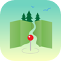

# Coordinates  
>
> Application to collect favorite places on the map.
>
> Written in SwiftUI.

 

### Functionality of the App
1. Allows to create pins on chosen coordinates of the world map.
2. Lets user to add a title, a description and a photo to created annotations Photo can be taken with the phone camera or chosen from the gallery.
3. Allows user to see and edit a list of the saved places sorted alphabetically. Provides an additional detailed view for each annotation, it can be opened from the map or the list view.
4. Shows places nearby when user is adding a new annotation.

 

### Screenshots

*Map View*

 

*Adding a new place on the map*

 

*List of saved places*

 

### Features
- Usage MapKit & CoreData with SwiftUI.
- Adding and saving annotations on the map.
- Integration with Wikipedia, loading results in a list view as a selectable text for comfortable use.
- Custom views of Text Field to display multiple lines.
- Keyboard responder to lift up text fields.
- Access for user to make pictures with the camera, load from the gallery.

 

### Communication
If you find a bug or want to discuss a new feature, feel free to [reach out](mailto:Valerika.Hello@gmail.com).

 

### Credits

Information about places was copied from the free encyclopedia - [Wikipedia](https://en.wikipedia.org/).

Fabulous pictures that I'd shown in this App are made by [Martin Katler](https://unsplash.com/@martinkatler), [Honey Yanibel](https://unsplash.com/@honeyyanibel) and [Connor McSheffrey](https://unsplash.com/@mcsheffrey). I am grateful to [Unsplash](https://unsplash.com) platform for the opportunity to find them.
